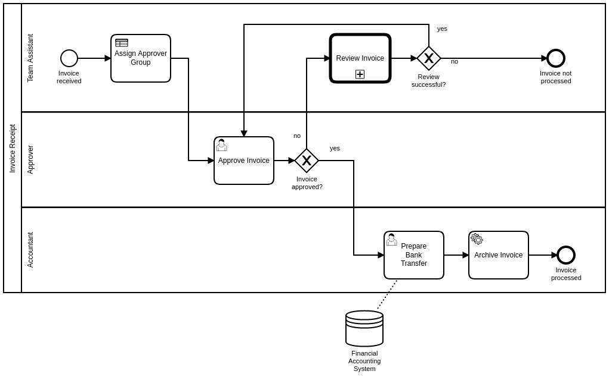

# invoice-approval-flow-app

## Questions & Answers

1) How long did it take you to solve the exercise? (Please be honest, we evaluate your answer to this question based on your experience.)

- 1 day, including a look around in your reference website, trying to understand the model, README.md, run.sh script, and answer the questions, etc

2) What are some edge cases that you might not have considered yet?

- When we have multiple start events
 
- When the XML is huge, too much memory space consumption may lead to some exceptions

3) What kind of problems/limitations can you think of in terms of your implementation?

- Calling the API and building the graph each time is not so efficient, especially when the XML is large

- Can consider configure some tools to test and monitor if our memory consumed is stable

- Can put parameters, like url, in some configuration file

## Environment
> Java 11

> Maven

## How to run it

> Option 1:  Run the **run.sh** script in the same folder

> Option 2:

```
 mvn clean package
 java -jar  target/invoice-approval-flow-app-1.0-SNAPSHOT-jar-with-dependencies.jar StartEvent_1 invoiceProcessed
```


## Run and Test

### AdjacencyList

For the flow chart as below

&#8194;&#8194; 


you will build an adjacencyList:

```
invoice_approved=[reviewInvoice, prepareBankTransfer], approveInvoice=[invoice_approved], StartEvent_1=[assignApprover], reviewInvoice=[reviewSuccessful_gw], assignApprover=[approveInvoice], reviewSuccessful_gw=[invoiceNotProcessed, approveInvoice], prepareBankTransfer=[ServiceTask_1], ServiceTask_1=[invoiceProcessed]
```

### Paths


- startId: approveInvoice, endId: invoiceProcessed

```
java -jar  target/invoice-approval-flow-app-1.0-SNAPSHOT-jar-with-dependencies.jar approveInvoice invoiceProcessed

The path from approveInvoice to invoiceProcessed is: [approveInvoice, invoice_approved, prepareBankTransfer, ServiceTask_1, invoiceProcessed]
```


- startId: StartEvent_1, endId: invoiceProcessed

```
java -jar  target/invoice-approval-flow-app-1.0-SNAPSHOT-jar-with-dependencies.jar StartEvent_1 invoiceProcessed

The path from approveInvoice to invoiceProcessed is: [StartEvent_1, assignApprover, approveInvoice, invoice_approved, prepareBankTransfer, ServiceTask_1, invoiceProcessed]
```


- startId: StartEvent_1, endId: invoiceNotProcessed

```
java -jar  target/invoice-approval-flow-app-1.0-SNAPSHOT-jar-with-dependencies.jar StartEvent_1 invoiceNotProcessed

The path from approveInvoice to invoiceProcessed is: [StartEvent_1, assignApprover, approveInvoice, invoice_approved, reviewInvoice, reviewSuccessful_gw, invoiceNotProcessed]
```

## Reference

[pmn-model-api: read-a-model](https://docs.camunda.org/manual/latest/user-guide/model-api/bpmn-model-api/read-a-model/)


